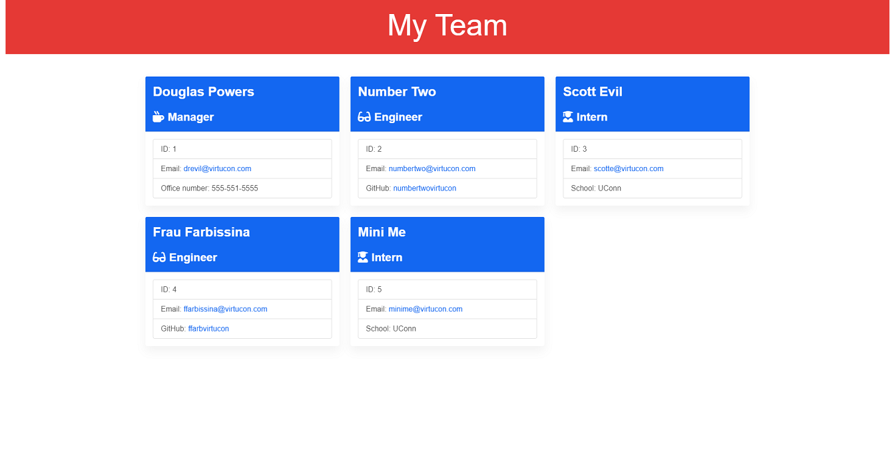
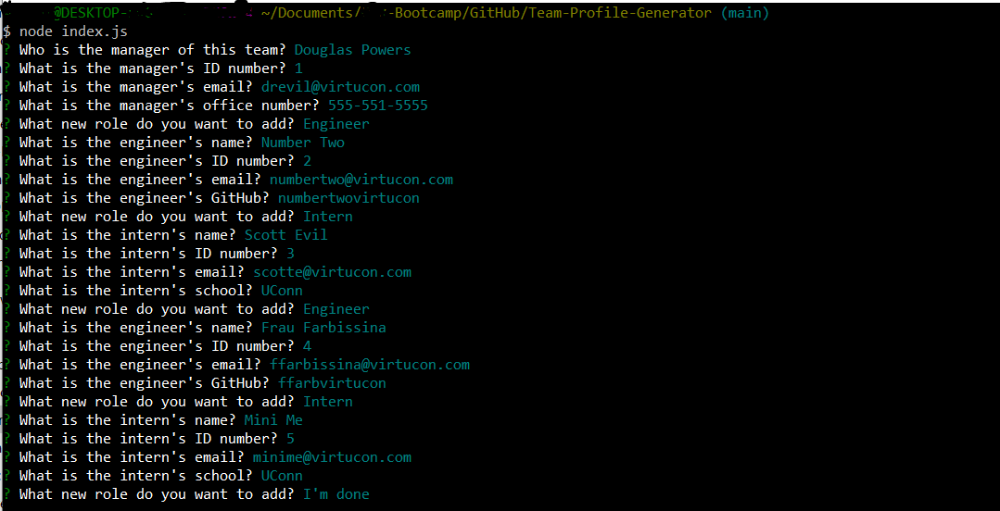

# Team-Profile-Generator

## Description
A manager can dynamically generate a webpage that displays their team's basic info
so that they have quick access to their emails and GitHub profiles. A summary for each role is generated by:
1. Manager
* ID
* Email
* Office Number
2. Engineer
* ID
* Email
* GitHub account
3. Intern
* ID
* Email
* School

## Installation
1. Clone repository
2. Open your [CLI](https://www.w3schools.com/whatis/whatis_cli.asp)
2. Install npm with inquirer
3. Install npm with jest
4. Run index.js using Node.js
```
node index.js
``` 
5. Answer the questions for each prompt
6. When finished, a HTML page will generate with the answers provided.

## Usage
### Screenshot





## Technologies
* HTML
* CSS
* JavaScript
* [Material Design for Bootstrap] (https://mdbootstrap.com/)
* [Animate.css] (https://animate.style/) 
* [Inquirer](https://www.npmjs.com/package/inquirer)
* [Node.js](https://nodejs.org/en/)
* [NPM] (https://www.npmjs.com/)
* [Jest](https://www.npmjs.com/package/jest)

## Video
[Demo of Team Profile Generator](https://1drv.ms/v/s!AtT3DKFm4NiYhAApMtSRpJqHraIB)